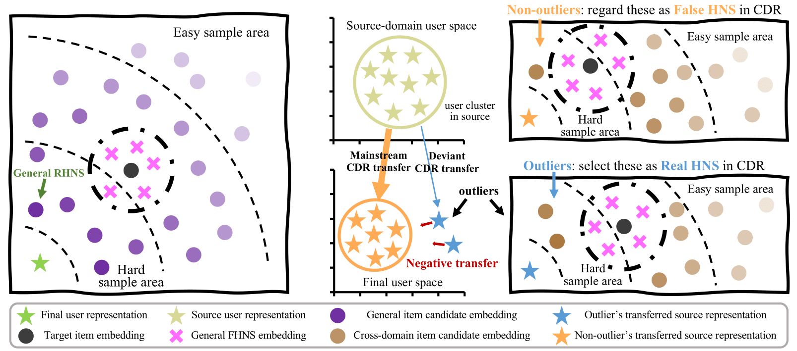

# RealHNS
The source code is for the paper: [Exploring False Hard Negative Sample in Cross-Domain Recommendation](https://dl.acm.org/doi/pdf/10.1145/3604915.3608791) accepted in Recsys 2023 by Haokai Ma, Ruobing Xie, Lei Meng, Xin Chen, Xu Zhang, Leyu Lin and Jie Zhou.

## Overview
This paper proposes a novel model-agnostic Real Hard Negative Sampling (RealHNS) framework specially for cross-domain recommendation (CDR), which aims to discover the false and refine the real from all HNS via both general and cross-domain real hard negative sample selectors. For the general part, we conduct the coarse- and fine-grained real HNS selectors sequentially, armed with a dynamic item-based FHNS filter to find high-quality HNS. For the cross-domain part, we further design a new cross-domain HNS for alleviating negative transfer in CDR and discover its corresponding FHNS via a dynamic user-based FHNS filter to keep its power.


## Dependencies
- Python 3.8.10
- PyTorch 1.12.0+cu102
- pytorch-lightning==1.6.5
- Torchvision==0.8.2
- Pandas==1.3.5
- Scipy==1.7.3

## Implementation of RealHNS
For the Game->Toy setting:
```
CUDA_VISIBLE_DEVICES=0 python RealHNS.py --dataset=amazon_toy --candidate_min_percentage_user 20 --candidate_max_percentage_user 30 --outlier_weight 0.1 --index 101
```

For the Toy->Game setting:
```
CUDA_VISIBLE_DEVICES=2 python RealHNS.py --dataset=amazon_game --candidate_min_percentage_user 10 --candidate_max_percentage_user 20 --outlier_weight 0.8 --index 101
```

## BibTeX
If you find this work useful for your research, please kindly cite RealHNS by:
```
@inproceedings{10.1145/3604915.3608791,
author = {Ma, Haokai and Xie, Ruobing and Meng, Lei and Chen, Xin and Zhang, Xu and Lin, Leyu and Zhou, Jie},
title = {Exploring False Hard Negative Sample in Cross-Domain Recommendation},
year = {2023},
publisher = {Association for Computing Machinery},
address = {New York, NY, USA},
doi = {10.1145/3604915.3608791},
booktitle = {Proceedings of the 17th ACM Conference on Recommender Systems},
location = {Singapore, Singapore},
series = {RecSys '23}
}
```

